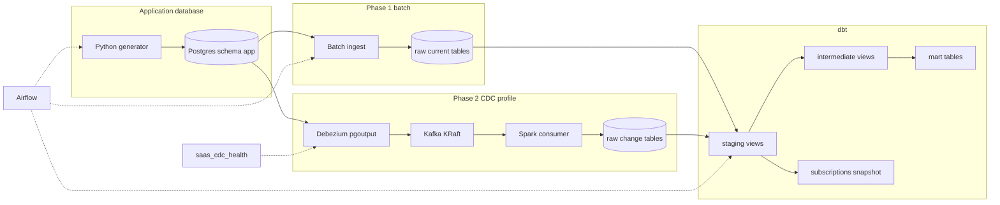

# saas-realtime-analytics

A small, laptop-runnable analytics stack for a simulated B2B SaaS product: organizations, users, SSO logins, subscriptions, and invoices. Phase 1 is a batch pipeline. Phase 2 adds Debezium change data capture beside that batch path.

This repo is a learning project for talking through dbt, Snowflake, Airflow, and Terraform the way a data platform team would build them. Local runs use Docker, Postgres, and DuckDB and do not need a cloud account.

## The problem

The application database is the system of record for the product. Analytics questions (monthly recurring revenue, logo churn, who is still paying, how logins and plan changes move) should not be answered by querying that database directly.

Phase 1 copies the app data into a warehouse on a schedule, checks it, and publishes a small set of marts. Phase 2 streams the same tables through Postgres logical replication into Kafka, and a consumer lands each change in an append-only raw table. Staging keeps the latest version per key, whether it came from the batch snapshot, the stream, or both.

## Architecture



Locally the warehouse is a DuckDB file. The same dbt project has a Snowflake target that reads credentials from the environment. Terraform describes the Snowflake database, warehouse, schemas, and roles. Applying it is optional.

| Piece | What it does |
| --- | --- |
| `generator/` | Writes and mutates realistic app rows in Postgres. `--seed` makes a run deterministic. |
| `ingest/` | Loads Postgres into `raw`. Current entities are full reloads. Facts are watermarked and idempotent. |
| `transform/` | dbt project: sources, staging, intermediate, marts, one incremental model, one snapshot, tests, docs. |
| `airflow/` | Daily DAG: tick, ingest, freshness, upstream build, then marts and snapshots. |
| `infra/snowflake/` | Terraform for an X-Small warehouse, the analytics database, schemas, and three roles. |
| `scripts/break_it.py` | Writes a negative MRR and shows that a failing test stops the marts from rebuilding. |
| `streaming/` | Parses Debezium events, deduplicates them, and lands them. Spark is the default consumer. A Python consumer is the smaller alternative. |
| `docker-compose.cdc.yml` | Kafka in KRaft mode, Debezium Connect, and one consumer. Not started by `make up`. |

Marts:

- `fct_mrr_monthly` — beginning MRR, new, expansion, contraction, churn, reactivation, ending MRR, and logo churn by month.
- `dim_organizations` — current org, plan, seats, user counts, and whether the org is active or paying.
- `fct_plan_changes` — subscription events classified as commercial movements.
- `fct_logins` — incremental login fact. Late-arriving rows are included because the filter uses load time.
- `fct_login_activity_daily` — daily counts, rebuilt from the login fact so a late event restates its day.
- `fct_invoices` — invoice facts.
- `subscriptions_snapshot` — SCD Type 2 history of plan, status, MRR, seats, and cancellation time.

## Run it on WSL2

Use Ubuntu on WSL2 with Docker Engine installed inside the distro, or Docker Desktop with the WSL integration enabled. Give the distro enough memory for the profile you start. These are caps, not observed usage. Record what you actually see in `docs/cost.md`.

| Profile | Command | Caps |
| --- | --- | --- |
| Phase 1 only | `make up` | Postgres 512 MB, Airflow 1536 MB |
| CDC with Spark | `make cdc-up` | Phase 1 caps, plus Kafka 768 MB, Connect 1024 MB, Spark 1536 MB |
| CDC with Python | `make cdc-up-python` | Phase 1 caps, plus Kafka 768 MB, Connect 1024 MB, Python consumer 384 MB |

From the repo root:

```bash
python3 -m venv .venv
source .venv/bin/activate
pip install -r requirements-dev.txt

cp .env.example .env
make up
```

Wait until Postgres is healthy (`docker compose ps`). Airflow is at [http://localhost:8080](http://localhost:8080). The local UI user and password are `admin` / `admin` unless you change them in `.env`. The DAG `saas_analytics_batch` is paused on creation and scheduled at 06:00 UTC. Unpause it when you want the scheduler to run it, or trigger it by hand.

Commands you run on the host talk to Postgres at `localhost:5432`. The Airflow container uses the hostname `postgres`. Do not run a host `dbt build` and an Airflow dbt task at the same time: DuckDB allows one writer on `warehouse/analytics.duckdb`.

```bash
make seed          # replace app data; SEED defaults to 42
make ingest        # load raw into DuckDB
make dbt-build     # freshness, then staging and intermediate, then marts and snapshots
make dbt-docs      # generate docs and serve them
make tick          # one more day of mutations, then ingest and dbt-build again
make down
```

`make seed` truncates the app tables. It is the way back to a known history. After a re-seed, clear `raw.*_cdc` as well (`delete from` those tables) or a later CDC commit can outrank the historical snapshot. See `docs/decisions.md`.

## Change data capture

`make cdc-up` recreates Postgres with `wal_level=logical`, `max_wal_senders=4`, and `max_replication_slots=4`. The data volume is kept. Init scripts do not re-run on an existing volume, so create the publication yourself:

```bash
make cdc-prepare
make cdc-register
```

`cdc-prepare` creates the `replicator` role and the `app_publication` publication for the six app tables. It fails with a clear error if `wal_level` is not `logical`. `cdc-register` tells Kafka Connect to start the `saas-app` connector (`pgoutput`, slot `saas_app_slot`). The Spark consumer waits until that connector is `RUNNING`, then reads `saas.app.*`.

Host tools use `localhost:9094` for Kafka and `http://localhost:8080` for Airflow. Connect's REST API is on port 8083. Set `KAFKA_BOOTSTRAP_SERVERS=localhost:9094` in `.env` when you run the Python consumer on the host.

`make cdc-up-python` starts the same broker and Connect, and the Python consumer instead of Spark. Do not run both consumers in the `saas-cdc-consumer` group at once.

`make cdc-down` stops Kafka, Connect, and the consumer. `make down` stops Phase 1. Airflow's `saas_cdc_health` DAG only checks connector status and prints lag. It does not run the stream. With Phase 1 alone, `CDC_CONNECT_URL` is unset and that check skips successfully.

```bash
make cdc-lag
make cdc-replay
make cdc-schema-change
make cdc-crash
make cdc-poison
make consumer-test
```

The four demo targets run against a temporary DuckDB file, so they do not need Kafka and they do not touch `warehouse/analytics.duckdb`. `LIVE=1` adds a broker reachability check when you have the profile up. What each demo proves is in `docs/walkthrough.md`.

## Failure demo

Python 3.11 or 3.12 is enough. CI uses 3.12. dbt is pinned to 1.11 because that is the newest line that publishes both `dbt-duckdb` and `dbt-snowflake`.

## Failure demo

After a successful `make dbt-build`:

```bash
make break-it
```

The script sets one active subscription's `mrr_cents` to `-500` in Postgres, re-ingests, and runs the dbt gate. The `non_negative` test on staging fails. Marts and the snapshot are not rebuilt. On DuckDB the script checks that `fct_mrr_monthly` and `dim_organizations` still have the previous build timestamp and row counts. Exit code 0 means the demo behaved. The bad row stays in Postgres until you heal it:

```bash
make heal
```

Heal writes the catalog MRR for that plan back, re-ingests, and rebuilds. The build timestamp on the MRR mart moves.

## Snowflake

Leave `WAREHOUSE_TARGET=duckdb` until you have a trial account. Nothing in git contains a password.

1. Copy `.env.example` to `.env` and fill the Snowflake variables. dbt wants `SNOWFLAKE_ACCOUNT` as the account identifier. Terraform wants `SNOWFLAKE_ORGANIZATION_NAME` and `SNOWFLAKE_ACCOUNT_NAME` separately, and `SNOWFLAKE_ROLE` (often `ACCOUNTADMIN` on a trial, only for apply).
2. `cd infra/snowflake && terraform init && terraform plan`. Read the plan. `terraform apply` creates the warehouse, database, schemas, roles, and grants.
3. Optional: set `TF_VAR_grant_to_user` to an existing user so the three roles are granted to that user.
4. `WAREHOUSE_TARGET=snowflake make ingest` then `WAREHOUSE_TARGET=snowflake make dbt-build`.
5. Copy credit figures from Snowsight into `docs/cost.md`. Do not estimate them.

`terraform validate` does not need credentials. `terraform plan` and `apply` do. A plan against a fake account fails at authentication, which is the closed-by-default behavior.

## What you will notice between DuckDB and Snowflake

SQL in the models stays on constructs both adapters accept (`QUALIFY`, `datediff`, standard joins). The differences that needed a branch:

- `fct_logins` uses `merge` on Snowflake and `delete+insert` on DuckDB.
- Month arithmetic goes through the `add_months` macro (`dateadd` on Snowflake, an interval elsewhere).
- Identifiers are unquoted. DuckDB folds them to lower case and Snowflake to upper case, which matches dbt with quoting off.
- Snowflake outputs in `transform/profiles.yml` default to empty strings so `dbt parse` on the DuckDB target still renders. Pass `--target` (the Makefile does) when you select a warehouse.

More of the reasoning is in `docs/decisions.md`. A guided tour and interview-style questions are in `docs/walkthrough.md`.

## CI

On every pull request, GitHub Actions lints with ruff and sqlfluff, seeds Postgres, runs `dbt build` against DuckDB, runs the batch failure demo and the heal, checks that a CDC delete and a CDC-only organization collapse to one staging row, runs the consumer unit tests, and runs `terraform fmt -check` plus `terraform validate`. The unit tests do not start Kafka.
