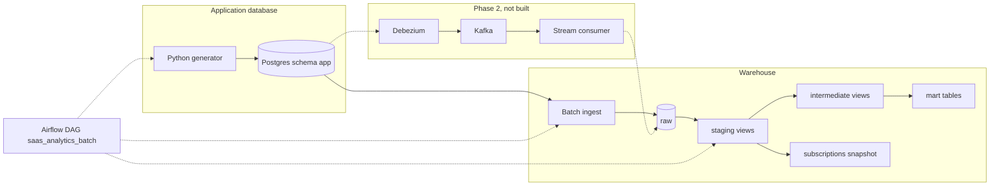

# saas-realtime-analytics

A small, laptop-runnable analytics stack for a simulated B2B SaaS product: organizations, users, SSO logins, subscriptions, and invoices. Phase 1 is a batch pipeline. A later phase can add change-data capture beside the same raw tables.

This repo is a learning project for talking through dbt, Snowflake, Airflow, and Terraform the way a data platform team would build them. Local runs use Docker, Postgres, and DuckDB and do not need a cloud account.

## The problem

The application database is the system of record for the product. Analytics questions (monthly recurring revenue, logo churn, who is still paying, how logins and plan changes move) should not be answered by querying that database directly.

Phase 1 copies the app data into a warehouse on a schedule, checks it, and publishes a small set of marts. The copy is a batch extract. The raw schema is shaped so a streaming feed can land in the same place later without rewriting the marts.

## Architecture



Locally the warehouse is a DuckDB file. The same dbt project has a Snowflake target that reads credentials from the environment. Terraform describes the Snowflake database, warehouse, schemas, and roles. Applying it is optional.

| Piece | What it does |
| --- | --- |
| `generator/` | Writes and mutates realistic app rows in Postgres. `--seed` makes a run deterministic. |
| `ingest/` | Loads Postgres into `raw`. Current entities are full reloads. Facts are watermarked and idempotent. |
| `transform/` | dbt project: sources, staging, intermediate, marts, one incremental model, one snapshot, tests, docs. |
| `airflow/` | Daily DAG: tick, ingest, freshness, upstream build, then marts and snapshots. |
| `infra/snowflake/` | Terraform for an X-Small warehouse, the analytics database, schemas, and three roles. |
| `scripts/break_it.py` | Writes a negative MRR and shows that a failing test stops the marts from rebuilding. |

Marts:

- `fct_mrr_monthly` — beginning MRR, new, expansion, contraction, churn, reactivation, ending MRR, and logo churn by month.
- `dim_organizations` — current org, plan, seats, user counts, and whether the org is active or paying.
- `fct_plan_changes` — subscription events classified as commercial movements.
- `fct_logins` — incremental login fact. Late-arriving rows are included because the filter uses load time.
- `fct_login_activity_daily` — daily counts, rebuilt from the login fact so a late event restates its day.
- `fct_invoices` — invoice facts.
- `subscriptions_snapshot` — SCD Type 2 history of plan, status, MRR, seats, and cancellation time.

## Phase 2

Not in this repository yet. The intended next step is Debezium from Postgres into Kafka, then a Spark Structured Streaming or small Python consumer that lands deduplicated events into `raw` with `_source_system = debezium`. Staging already selects columns by name, so extra CDC metadata can sit on the landing tables. Schema-change and replay demos belong in that phase.

## Run it on WSL2

Use Ubuntu on WSL2 with Docker Engine installed inside the distro, or Docker Desktop with the WSL integration enabled. Give the distro enough memory for the caps below: Postgres is limited to 512 MB and Airflow to 1536 MB. Those are caps. Record what you actually observe in `docs/cost.md`.

From the repo root:

```bash
python3 -m venv .venv
source .venv/bin/activate
pip install -r requirements-dev.txt

cp .env.example .env
make up
```

Wait until Postgres is healthy (`docker compose ps`). Airflow is at [http://localhost:8080](http://localhost:8080). The local UI user and password are `admin` / `admin` unless you change them in `.env`. The DAG `saas_analytics_batch` is paused on creation and scheduled at 06:00 UTC. Unpause it when you want the scheduler to run it, or trigger it by hand.

Commands you run on the host talk to Postgres at `localhost:5432`. The Airflow container uses the hostname `postgres`. Do not run a host `dbt build` and an Airflow dbt task at the same time: DuckDB allows one writer on `warehouse/analytics.duckdb`.

```bash
make seed          # replace app data; SEED defaults to 42
make ingest        # load raw into DuckDB
make dbt-build     # freshness, then staging and intermediate, then marts and snapshots
make dbt-docs      # generate docs and serve them
make tick          # one more day of mutations, then ingest and dbt-build again
make down
```

`make seed` truncates the app tables. It is the way back to a known history.

Python 3.11 or 3.12 is enough. CI uses 3.12. dbt is pinned to 1.11 because that is the newest line that publishes both `dbt-duckdb` and `dbt-snowflake`.

## Failure demo

After a successful `make dbt-build`:

```bash
make break-it
```

The script sets one active subscription's `mrr_cents` to `-500` in Postgres, re-ingests, and runs the dbt gate. The `non_negative` test on staging fails. Marts and the snapshot are not rebuilt. On DuckDB the script checks that `fct_mrr_monthly` and `dim_organizations` still have the previous build timestamp and row counts. Exit code 0 means the demo behaved. The bad row stays in Postgres until you heal it:

```bash
make heal
```

Heal writes the catalog MRR for that plan back, re-ingests, and rebuilds. The build timestamp on the MRR mart moves.

## Snowflake

Leave `WAREHOUSE_TARGET=duckdb` until you have a trial account. Nothing in git contains a password.

1. Copy `.env.example` to `.env` and fill the Snowflake variables. dbt wants `SNOWFLAKE_ACCOUNT` as the account identifier. Terraform wants `SNOWFLAKE_ORGANIZATION_NAME` and `SNOWFLAKE_ACCOUNT_NAME` separately, and `SNOWFLAKE_ROLE` (often `ACCOUNTADMIN` on a trial, only for apply).
2. `cd infra/snowflake && terraform init && terraform plan`. Read the plan. `terraform apply` creates the warehouse, database, schemas, roles, and grants.
3. Optional: set `TF_VAR_grant_to_user` to an existing user so the three roles are granted to that user.
4. `WAREHOUSE_TARGET=snowflake make ingest` then `WAREHOUSE_TARGET=snowflake make dbt-build`.
5. Copy credit figures from Snowsight into `docs/cost.md`. Do not estimate them.

`terraform validate` does not need credentials. `terraform plan` and `apply` do. A plan against a fake account fails at authentication, which is the closed-by-default behavior.

## What you will notice between DuckDB and Snowflake

SQL in the models stays on constructs both adapters accept (`QUALIFY`, `datediff`, standard joins). The differences that needed a branch:

- `fct_logins` uses `merge` on Snowflake and `delete+insert` on DuckDB.
- Month arithmetic goes through the `add_months` macro (`dateadd` on Snowflake, an interval elsewhere).
- Identifiers are unquoted. DuckDB folds them to lower case and Snowflake to upper case, which matches dbt with quoting off.
- Snowflake outputs in `transform/profiles.yml` default to empty strings so `dbt parse` on the DuckDB target still renders. Pass `--target` (the Makefile does) when you select a warehouse.

More of the reasoning is in `docs/decisions.md`. A guided tour and interview-style questions are in `docs/walkthrough.md`.

## CI

On every pull request, GitHub Actions lints with ruff and sqlfluff, seeds Postgres, runs `dbt build` against DuckDB, runs the failure demo and the heal, and runs `terraform fmt -check` plus `terraform validate`.
